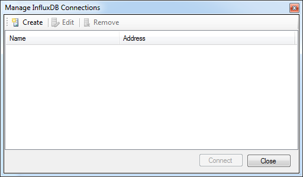

# InfluxDB Studio
**.NET Management Tools for InfluxDB and the TICK stack**

InfluxDB Studio is a UI management tool for [the InfluxDB time series database](https://www.influxdata.com/time-series-platform/influxdb/).
Its inspiration comes from other similar database management tools such as [SQL Server Management Studio](https://en.wikipedia.org/wiki/SQL_Server_Management_Studio)
and [Robomongo](https://robomongo.org/). Under the hood it's powered by [InfluxData.Net](https://github.com/pootzko/InfluxData.Net)
which is a portable InfluxDB client library for .NET (plus some [Kapacitor](https://www.influxdata.com/time-series-platform/kapacitor/)).
InfluxDB Studio presently implements interfaces and workflows for most of the InfluxData.Net API.

The following are planned features that are not yet implemented in the current version:

* _Retention Policy management_
* _An interface for writing point data directly to the database_
* _Custom stats view for server stats (diagnostics is presently supported)_

